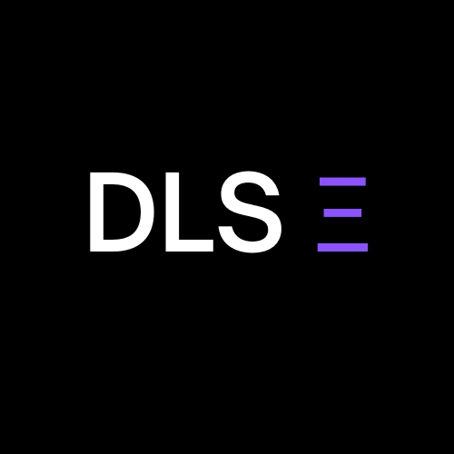
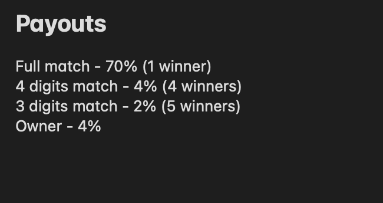

<p align="center">
  <a href="https://dls-front-end-0.vercel.app/">
    
  </a>

  <h3 align="center">DLS Ξ</h3>

  <p align="center">
    A twist on the traditional lottery
    <br />
    <br />
    <a href="https://dls-front-end-0.vercel.app/">Launch App</a>
    .
    <a href="https://youtu.be/JFKBL6t2eQA">Video Demo</a>
    ·
    <a href="https://github.com/merkle-groot/DLS-Smart-Contracts/issues">Report Bug</a>
    ·
    <a href="https://github.com/merkle-groot/DLS-Smart-Contracts/issues/issues">Request Feature</a>
  </p>
</p>


<!-- TABLE OF CONTENTS -->
<details open="open">
  <summary>Table of Contents</summary>
  <ol>
    <li>
      <a href="#about-the-project">About The Project</a>
      <ul>
        <li><a href="#built-with">Built With</a></li>
      </ul>
    </li>
    <li>
      <a href="#getting-started">Getting Started</a>
      <ul>
        <li><a href="#prerequisites">Prerequisites</a></li>
        <li><a href="#installation">Installation</a></li>
        <li><a href="#deployment"> Deployment to Mumbai Testnet </a></li>
      </ul>
    </li>
    <li><a href="#contracts">Smart Contracts</a></li>
    <li><a href="#contributing">Contributing</a></li>
    <li><a href="#license">License</a></li>
  </ol>
</details>


<!-- ABOUT THE PROJECT -->
## About The Project
**Video Demo** : [YouTube Link](https://youtu.be/JFKBL6t2eQA) 

**Design Explanation** : [Youtube Link](https://youtu.be/Ovh2FRjWpe4)

---

*What is DLS?*

It's a **new take on the traditional lottery system** found in web3, instead of a single lotery winner, we have **multiple**.

*How does it work?*

We borrowed a few ideas from irl lottery systems and 
introduced the concept of **series** and **number** for a lottery ticket.  

The lottery tickets are divided in to 5 series and within each series there are 2000 tickets.

i.e </br>
```
series - [A, B, C, D, E]
ticketNumbers - [1, 2000]
```

A user can buy a maximum of one ticket and they have the choice to select the series and ticket number. Once bought, it cannot be sold or transferred. There's a time window of **7 days** since the deployment of **Lotto contract** to buy a ticket.

After 7 days, the contract requests 2 random numbers from the **ChainLink** VRF contract which is used to select the winning ticket.

For e.g - 

If the winning ticket was "A 1438":

* The person holding "A 1438" gets 70% of the pooled funds. (1 winner)
* The person holding the ticket with the number 1438 but of a different series will get 4% of the pool. (4 winners, "B 1438", "C 1438", "D 1438", "E 1438")
* The person holding the ticket with the number ending with "438" will get 2% of the pool.
* The owner (deployer) of the contract gets 4% of the pool.

*Payout Scheme*



*What if the winning ticket wasn't bought by anyone?*

* n that case, we shift the contract to the buying period after 2 days of the cash-out period, i.e., the funds locked in the contract are moved forward to a new lottery round.

* The lottery rounds keep happening until, there's a winner with full match.

* **current_epoch** variable is used to keep track of the number of rounds that the contract has been through.

*What problem does it solve?*

In traditional lotteries, only one person wins the entire prize pool, leaving everyone else empty-handed. With DLS, multiple winners are chosen based on their ticket numbers, which means more people have a chance to win and potentially receive a portion of the prize pool

### Built With

* [Brownie](https://eth-brownie.readthedocs.io/)
* [ChainLink](https://chain.link/)


---
<!-- GETTING STARTED -->
## Getting Started

To get a local copy up and running follow these steps.

### Prerequisites

This project requires python3 installation

---
### Installation

1. Install the required dependencies:

```
pip install -r requirements.txt
```
2. Fetch open-zeppelin contracts using pm
```
brownie pm install OpenZeppelin/openzeppelin-contracts@0.4.0
```
3. Compile the contracts
```
brownie compile
```
4. Test the contrcts
```
brownie test
```

---
### Deploying to Matic Mumbai Testnet

1. Create an .env file in the root of the directory with 

```
export WEB3_INFURA_PROJECT_ID='put our project id here'
export PRIVATE_KEY='Put your wallet private key here'
```
2. Load the env variables
```
source .env
```
3. Create a ChainLink subscription
```
brownie run scripts/vrf_scripts/create_subscription.py --network polygon-test      
```
4. Update *./scripts/deploy_contracts.py* with the right subscription ID from the last step

5. Deploy the Lotto and USDC contract
```
brownie run scripts/deploy_contracts.py --network polygon-test
```
---
</br> 


<!-- CONTRACTS -->
## Contracts
The smart-contracts have been deployed to 
1. Matic Mumbai TestNet: 
    1. Lotto Contract [0x8f23A9b80A49792EDA850A95A61143e4783aD6cC](https://sepolia.etherscan.io/address/0x8f23A9b80A49792EDA850A95A61143e4783aD6cC)
    2. USDC Contract [0x2aDC2Af787f19f908683c29Ab702D932F8F2e0CE](https://sepolia.etherscan.io/address/0x2aDC2Af787f19f908683c29Ab702D932F8F2e0CE)
2. Sepolia TestNet: 
    1. Lotto Contract [0xcad983583f0d5940b3be81d4a89db474d63c6993](https://sepolia.etherscan.io/address/0xcad983583f0d5940b3be81d4a89db474d63c6993)
    2. USDC Contract [0x1FE38D56D80E388F21ea8b0F6AE2A92C681dA1c3](https://sepolia.etherscan.io/address/0x1FE38D56D80E388F21ea8b0F6AE2A92C681dA1c3)


<!-- CONTRIBUTING -->
## Contributing

Contributions are what make the open source community such an amazing place to be learn, inspire, and create. Any contributions you make are **greatly appreciated**.

1. Fork the Project
2. Create your Feature Branch (`git checkout -b feature/AmazingFeature`)
3. Commit your Changes (`git commit -m 'Add some AmazingFeature'`)
4. Push to the Branch (`git push origin feature/AmazingFeature`)
5. Open a Pull Request

<!-- LICENSE -->
## License

Distributed under the MIT License. See `LICENSE` for more information.

